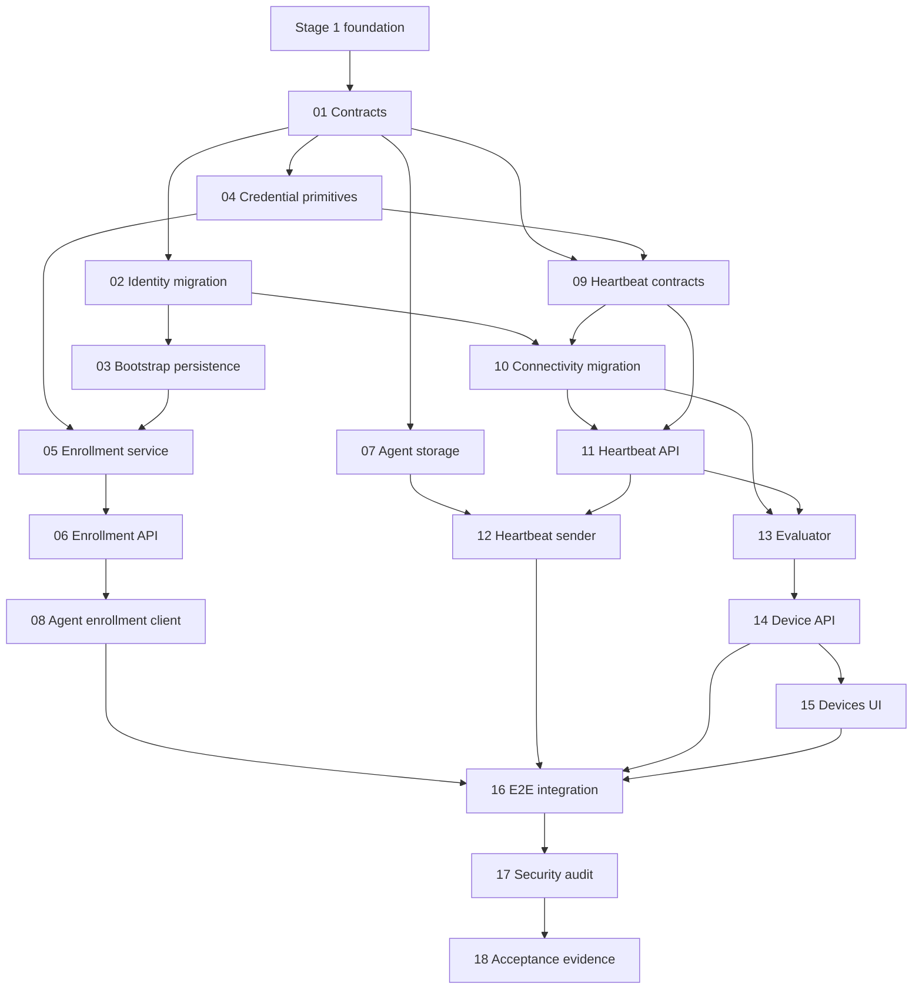

# Device Watch Stage 2 Plan

Stage 2 adds enrollment, device identity, authenticated minimal heartbeats, and current connectivity state on top of the verified Stage 1 foundation. This directory records the original planning set and current implementation statuses. Execute only the explicitly requested step.

## Execution Matrix

| Step | Name | Depends on | Status |
| --- | --- | --- | --- |
| 01 | Domain contracts and persistence boundaries | Stage 1 | Complete |
| 02 | Device identity migration | 01 | Complete |
| 03 | Bootstrap provisioning and persistence | 01, 02 | Pending |
| 04 | Credential hashing and verification primitives | 01 | Complete |
| 05 | Enrollment transaction service | 02, 03, 04 | Pending |
| 06 | Enrollment API contract and endpoint | 05 | Complete |
| 07 | Agent secure identity storage | Stage 1 agent | Pending |
| 08 | Agent enrollment client | 06, 07 | Pending |
| 09 | Heartbeat protocol contracts and idempotency | 01, 04 | Pending |
| 10 | Current connectivity-state migration | 02, 09 | Pending |
| 11 | Authenticated heartbeat service and API | 04, 09, 10 | Pending |
| 12 | Agent heartbeat sender and retry policy | 07, 09, 11 | Pending |
| 13 | Online/offline evaluator | 10, 11 | Pending |
| 14 | Device query API | 02, 10, 13 | Pending |
| 15 | Devices connectivity UI | 14 | Pending |
| 16 | End-to-end enrollment and heartbeat integration | 06, 08, 11, 12, 14 | Pending |
| 17 | Stage 2 security and scope audit | 15, 16 | Pending |
| 18 | Stage 2 acceptance verification and evidence | 17 | Pending |

## Execution Order

Steps 01–04 establish contracts and independent primitives. Steps 02 and 04 may proceed in parallel after Step 01. Step 03 follows the identity schema. Steps 05–06 are strictly sequential server enrollment work. Steps 07–08 are agent enrollment work and may proceed after the protocol boundary in Step 06. Steps 09–13 define and implement heartbeat state; persistence and transport remain separated. Steps 14–15 add read-only visibility. Steps 16–18 are sequential integration, audit, and evidence checkpoints.

## Dependency Graph

## Parallel and Sequential Boundaries

- Parallel after Step 01: Step 02 identity migration, Step 04 credential primitives, and Step 07 agent storage design/implementation may be developed independently, but each still uses its own numbered session.
- Parallel after Step 06/09 contracts: Step 08 agent enrollment client and Step 10 current-state migration can proceed independently once their contracts are approved.
- Strictly sequential: 03 after 02; 05 after 02–04; 06 after 05; 08 after 06–07; 11 after 09–10; 12 after 11; 13 after 10–11; 14 after 13; 15 after 14; 16 after all runtime slices; 17 after 16; 18 after 17.

## Acceptance Coverage

- Steps 01–04: A02–A04 and migration/security foundations.
- Steps 05–06: A03–A05.
- Steps 07–08: A01, A06–A07.
- Steps 09–13: A08–A12.
- Steps 14–15: A13–A14.
- Step 16: A03–A13 and A15–A16.
- Step 17: required negative evidence and A15.
- Step 18: all A01–A16 evidence and final boundary review.

## Stage 1 Contracts Stage 2 Must Preserve

Health-only Stage 1 routes remain available; the existing app factory/lifespan remains the ownership boundary; MySQL/PyMySQL and Alembic remain the database stack; migration history starts at `20260831_0001`; logging remains secret-safe; Caddy remains the only public ingress; `/api` remains path-preserved; agent runtime remains outbound-only; and the collector registry remains empty because heartbeats are connectivity transport, not metric collection.

## Current Handoff

[Step 06](06-enrollment-api.md) is complete at the API boundary: `POST /api/v1/enrollment` validates the four-field request, returns the five-field `201` contract, and sanitizes validation and service failures without secret echo. API, health/lifecycle regression, logging, Ruff, and strict mypy checks pass. [Step 03](03-bootstrap-provisioning.md) and [Step 05](05-enrollment-service.md) retain their **BLOCKED BY ENVIRONMENT** MySQL verification and Pending statuses; API tests do not prove database atomicity, concurrency, or migration behavior. See the [current progress record](../../../progress/current-status.md) for commands, status codes, and deployment assumptions. Step 07 has not started and requires a separate explicit request.

## Planning Boundary

Every step is implementation-sized and must be executed in a separate coding session. No Stage 2 route, table, migration, collector, sender, credential, or UI behavior is implemented by this planning set.
